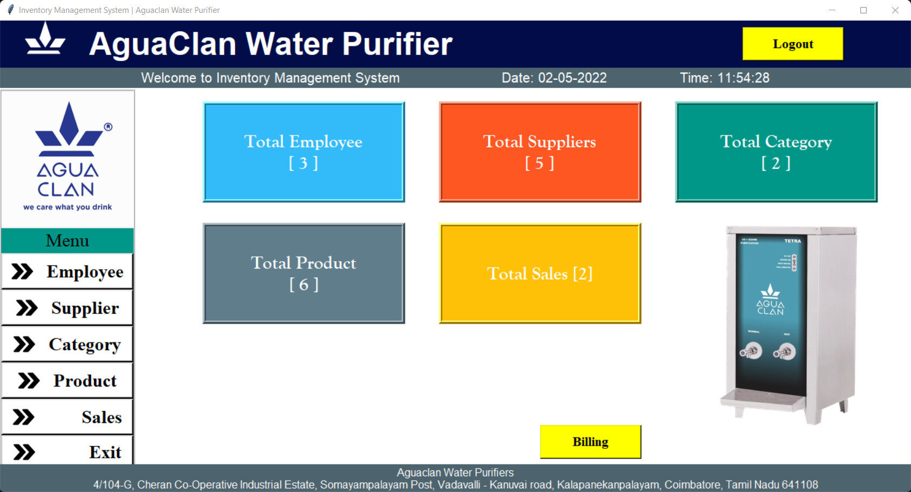
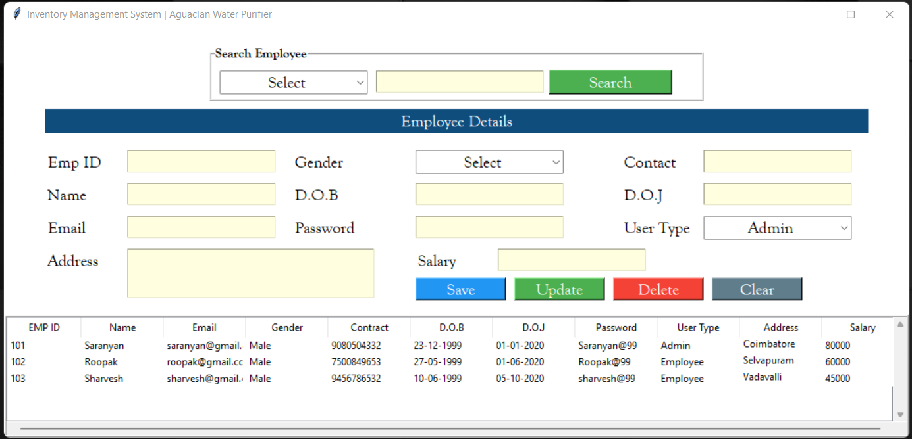
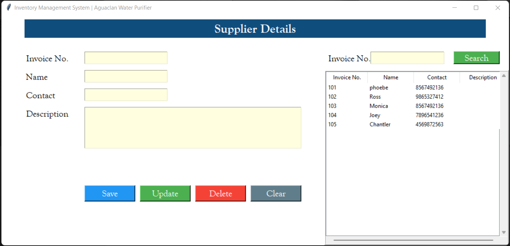
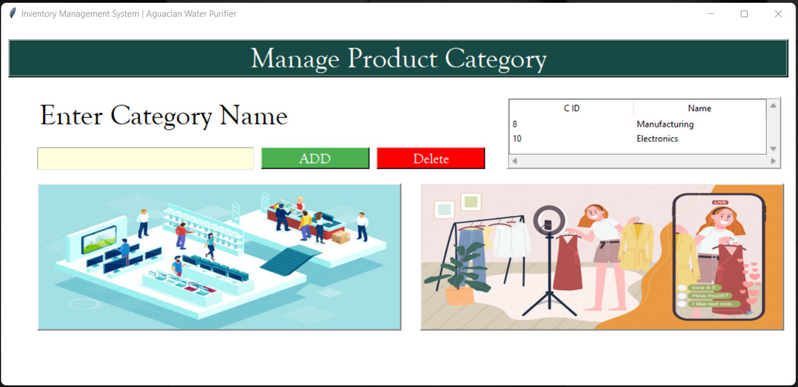
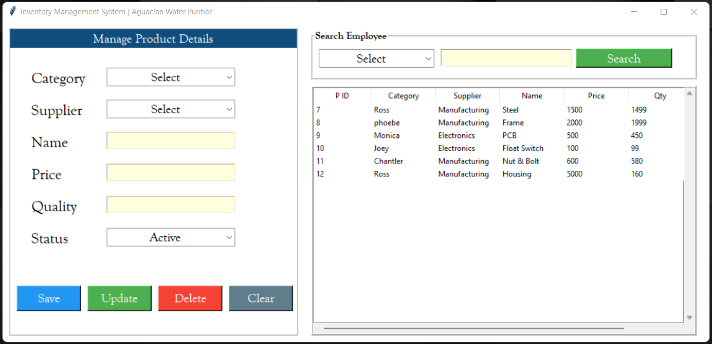
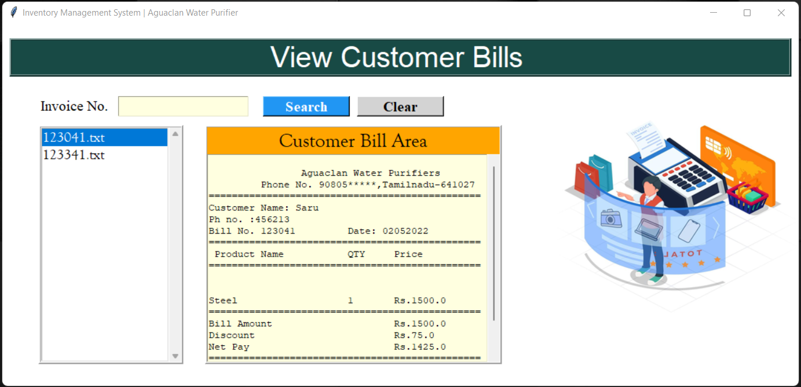
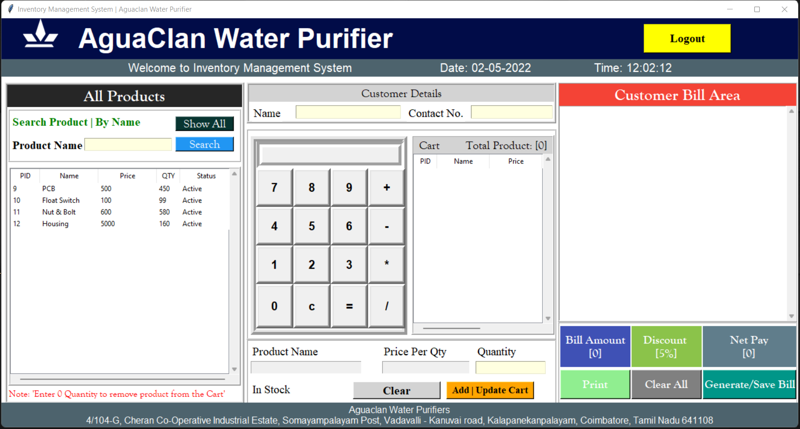

# Inventory_management_software
This is an Inventory Management System which is been developed for a particular company. In this management there various attributes like employees, products, sales, billing, employee QR etc. So in each of this attributes we can add update create delete the users or products. Then in the billing area we can able to generate a bill copy and can be saved in local drive also. And before all this there will be a Login Page, so after login page only we can able to access the management system. 

hey

